#  SmartCrop AI

**SmartCrop AI** is an intelligent mobile application that empowers smallholder farmers with AI-driven crop disease detection and expert farming recommendations. It leverages image recognition and machine learning to identify diseases in several crops, and provides practical mitigation guidance tailored to each case even in offline environments.

## App Overview

In many farming communities, timely identification and management of crop diseases is a major challenge. While existing tools exist, they are often expensive, require constant internet access, or are not user-friendly. **SmartCrop AI** fills this gap with a lightweight, offline-first assistant that combines:

- **Convolutional Neural Networks (CNN)** for accurate image classification.
- **On-device TensorFlow Lite (TFLite)** inference for performance and privacy.
- **Gemini-powered assistant** for personalized, AI-generated advice.
- **Rich resource support** like videos, markdown tips, and localized explanations.

---
## Architecture 

```mermaid
sequenceDiagram
    actor User
    participant App as 📱 Flutter App
    participant TFLite as ⚙️ TFLite Model
    participant DB as 🗄️ Disease DB
    participant Gemini as 🧠 Gemini AI

    note right of User: Detection Flow
    User->>App: Captures Image
    App->>TFLite: Sends Image for Inference
    TFLite->>DB: Matches Label
    TFLite->>Gemini: Sends Detection Summary
    Gemini-->>App: Returns Detection Result and Dynamic Suggestions

    note right of User: Chat Flow
    User->>App: Asks Question
    App->>Gemini: Sends Query + Context
    Gemini-->>App: Returns Context-aware Answer
```

## ⚡Features

- **Image-Based Disease Detection**  
  Capture or select a crop image to detect diseases instantly using trained CNN models.

- **Multi-Crop Support**  
  Currently supports **tomato**, **potato**, and **mango** crops each with its own tailored model and metadata.

- **AI-Powered Assistance**  
  Integrated NLP assistant that understands crop-specific questions and provides contextual replies.

- **Offline Functionality**  
  All detection is handled locally on-device with TFLite — no internet required after initial setup.

- **Expert Recommendations**  
  Displays disease-specific mitigation steps, video links, and AI-generated expert advice.

- **Local Result Storage**  
  Save and review previous detections directly from the app’s local storage.

---

### Main Components:

- **Flutter App (Frontend)**: Handles image input, UI, and navigation.
- **Fast API Inference Service**: Loads and runs the ML model.
- **Gemini API Service**: Processes crop questions using NLP for assistant replies.
- **Hive Local Storage**: Saves detection history for offline access.
- **Markdown + Charts Renderer**: Presents confidence scores, video tips, and expert content beautifully.

---

## How to Install and Run

### 1. Prerequisites

- Flutter SDK (>= 3.x)
- Dart SDK
- Android Studio or Visual Studio Code

### 2. Clone the repository

```bash
git clone https://github.com/tekle-eyesus/farmwise_ai.git
cd farmwise_ai
```

### 3. Install dependencies

```bash
flutter pub get
```

### 4. Run the app

```bash
flutter run
```

## Technologies Used

| Technology           | Purpose                            |
| -------------------- | ---------------------------------- |
| Flutter              | Cross-platform UI development      |
| TensorFlow Lite      | On-device deep learning inference  |
| Gemini Pro API       | NLP assistant integration          |
| Hive + Path Provider | Local data storage                 |
| Fast API             | Image preprocessing and tensor ops |
| Image Picker         | Capture and select images          |
| Markdown             | Rich text rendering for UI tips    |
| FL Chart             | Display confidence charts          |
